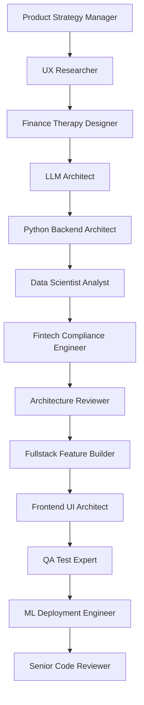

# Dr. Sigmund Spend - Local LLM Financial Therapist

**Project Codename:** "Dr. Sigmund Spend"  
**Phase:** Post-Phase 4 B5.2 (Third-Party Integrations Complete)  
**Timeline:** TBD (Estimated 8-12 months)  
**Priority:** P1 Product Differentiator  

## 🎯 Vision Statement

Transform FinGood into the first AI-powered financial therapy platform featuring Dr. Sigmund Spend - a German-accented financial therapist that provides natural language conversations about personal finances, delivering precise data-driven insights with the soothing manner of a real therapist.

## 🧠 Product Concept

**Dr. Sigmund Spend** - An opinionated, slightly funny, German-accented financial therapist powered by local LLM (Llama3.1/Mistral7B via Ollama) that:

- **Natural Language Processing**: Understands laymen financial questions in conversational English
- **Data Integration**: Queries actual user financial data via function calls or MCP
- **Therapeutic Communication**: Responds with precise financial insights in a calming, therapeutic manner
- **German Personality**: Maintains consistent character with slight German accent and humor
- **Privacy-First**: All processing happens locally, ensuring financial data never leaves user's environment

## 🎭 Character Profile: Dr. Sigmund Spend

**Personality Traits:**
- Wise but approachable financial therapist
- Slight German accent in written responses
- Uses therapeutic language and calming reassurance
- Occasionally funny but always professional
- References psychological concepts applied to financial behavior
- Emphasizes financial wellness over pure profit optimization

**Communication Style:**
- "Ach, I see you are having ze cash flow anxiety again, ja?"
- "Let me help you understand vhat your spending patterns are telling us..."
- "Zis is perfectly normal financial behavior - we can work through zis together"
- "Your money deserves ze same care as your mental health, mein friend"

## 🚀 Multi-Agent Development Pipeline

### **PHASE 1: STRATEGIC FOUNDATION (Weeks 1-3)**

#### **Agent 1: Product Strategy Manager** 
- **Role**: Define product vision and market positioning
- **Deliverables**:
  - Market analysis of AI-powered financial tools
  - Competitive differentiation strategy
  - User persona definition and journey mapping
  - Success metrics and KPI framework
- **Output**: Strategic foundation document

#### **Agent 2: UX Researcher**
- **Role**: User research and behavior analysis  
- **Dependencies**: Product strategy complete
- **Deliverables**:
  - User interview insights on financial anxiety and communication preferences
  - Conversational UI/UX patterns research
  - Therapeutic communication best practices
  - Natural language interaction design principles
- **Output**: User research findings and design principles

#### **Agent 3: Finance Therapy Designer** 
- **Role**: Character development and therapeutic approach
- **Dependencies**: UX research complete
- **Deliverables**:
  - Dr. Sigmund Spend character development guide
  - Therapeutic communication framework
  - Financial psychology conversation patterns
  - Anxiety-reducing interaction design
- **Output**: Character bible and therapeutic framework

---

### **PHASE 2: TECHNICAL ARCHITECTURE (Weeks 4-7)**

#### **Agent 4: LLM Architect**
- **Role**: Local LLM integration and optimization
- **Dependencies**: Character framework defined
- **Deliverables**:
  - Local LLM deployment strategy (Ollama/Llama3.1/Mistral7B)
  - Model fine-tuning approach for financial domain
  - Context management and memory optimization
  - Performance benchmarking and optimization
- **Output**: LLM technical architecture

#### **Agent 5: Python Backend Architect** 
- **Role**: Backend integration and function calling framework
- **Dependencies**: LLM architecture defined
- **Deliverables**:
  - Function calling vs MCP architecture decision
  - Financial data query abstraction layer
  - LLM-to-backend communication protocols
  - Error handling and fallback mechanisms
- **Output**: Backend integration architecture

#### **Agent 6: Data Scientist Analyst**
- **Role**: Financial data processing and ML integration
- **Dependencies**: Backend architecture defined
- **Deliverables**:
  - Financial data preprocessing pipelines
  - Integration with existing ML models (forecasting, categorization)
  - Scenario simulation engine design
  - Structured data RAG optimization
- **Output**: Data processing and ML integration plan

---

### **PHASE 3: COMPLIANCE & SECURITY (Weeks 8-9)**

#### **Agent 7: Fintech Compliance Engineer**
- **Role**: Financial regulations and data privacy compliance
- **Dependencies**: Technical architecture complete
- **Deliverables**:
  - Regulatory compliance assessment (PCI DSS, GDPR, financial regulations)
  - Local processing compliance benefits documentation
  - Audit trail requirements for AI-generated financial advice
  - Risk mitigation strategies
- **Output**: Compliance framework and requirements

#### **Agent 8: Architecture Reviewer**
- **Role**: Security and scalability review
- **Dependencies**: Compliance requirements defined
- **Deliverables**:
  - Security architecture review
  - Scalability assessment and optimization recommendations
  - Performance bottleneck identification
  - System integration review
- **Output**: Architecture optimization recommendations

---

### **PHASE 4: IMPLEMENTATION PLANNING (Weeks 10-12)**

#### **Agent 9: Fullstack Feature Builder**
- **Role**: End-to-end implementation planning
- **Dependencies**: All previous phases complete
- **Deliverables**:
  - Feature development roadmap
  - Frontend-backend integration plan
  - Database schema modifications
  - API endpoint specifications
- **Output**: Implementation roadmap

#### **Agent 10: Frontend UI Architect** 
- **Role**: Conversational UI implementation planning
- **Dependencies**: Feature roadmap defined
- **Deliverables**:
  - Chat interface design and components
  - Real-time conversation flow implementation
  - Visualization integration for financial data
  - Responsive design for Dr. Sigmund interactions
- **Output**: Frontend implementation plan

#### **Agent 11: QA Test Expert**
- **Role**: Testing strategy and quality assurance
- **Dependencies**: Implementation plans complete
- **Deliverables**:
  - Comprehensive testing strategy for LLM integration
  - Conversation quality assessment framework
  - Performance testing for local LLM
  - User acceptance testing plan
- **Output**: QA and testing framework

---

### **PHASE 5: DEPLOYMENT & OPTIMIZATION (Weeks 13-16)**

#### **Agent 12: ML Deployment Engineer**
- **Role**: Production deployment and optimization
- **Dependencies**: Testing framework complete
- **Deliverables**:
  - Local LLM deployment pipeline
  - Performance monitoring and optimization
  - Model versioning and update strategies
  - Resource management and scaling
- **Output**: Deployment and optimization plan

#### **Agent 13: Senior Code Reviewer**
- **Role**: Final architecture and code quality review
- **Dependencies**: All implementation plans complete
- **Deliverables**:
  - Comprehensive code quality assessment
  - Architecture consistency review
  - Performance optimization recommendations
  - Security final review
- **Output**: Final quality assurance and go-live approval

---

## 📋 Agent Execution Sequence

## 🎯 Expected Outcomes

By the end of this multi-agent pipeline:

1. **Strategic Clarity**: Clear product vision and market positioning
2. **User-Centered Design**: Therapeutic communication framework
3. **Technical Foundation**: Robust local LLM architecture
4. **Compliance Assurance**: Full regulatory compliance
5. **Implementation Readiness**: Detailed development roadmap
6. **Quality Framework**: Comprehensive testing and deployment strategy

## 📅 Timeline Overview

- **Weeks 1-3**: Strategic Foundation (3 agents)
- **Weeks 4-7**: Technical Architecture (3 agents)  
- **Weeks 8-9**: Compliance & Security (2 agents)
- **Weeks 10-12**: Implementation Planning (3 agents)
- **Weeks 13-16**: Deployment & Optimization (2 agents)

**Total Planning Phase**: 16 weeks  
**Implementation Phase**: TBD (estimated 6-9 months post-planning)

---

*Dr. Sigmund Spend LLM Planning Document - Created August 19, 2025*